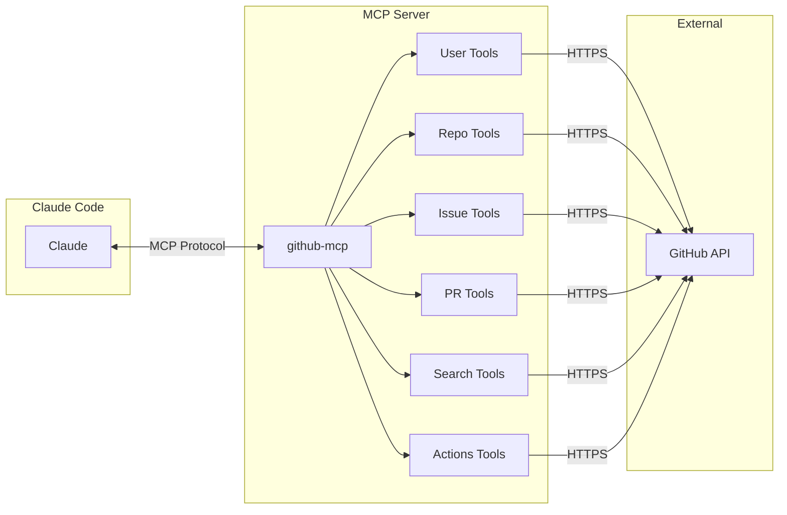
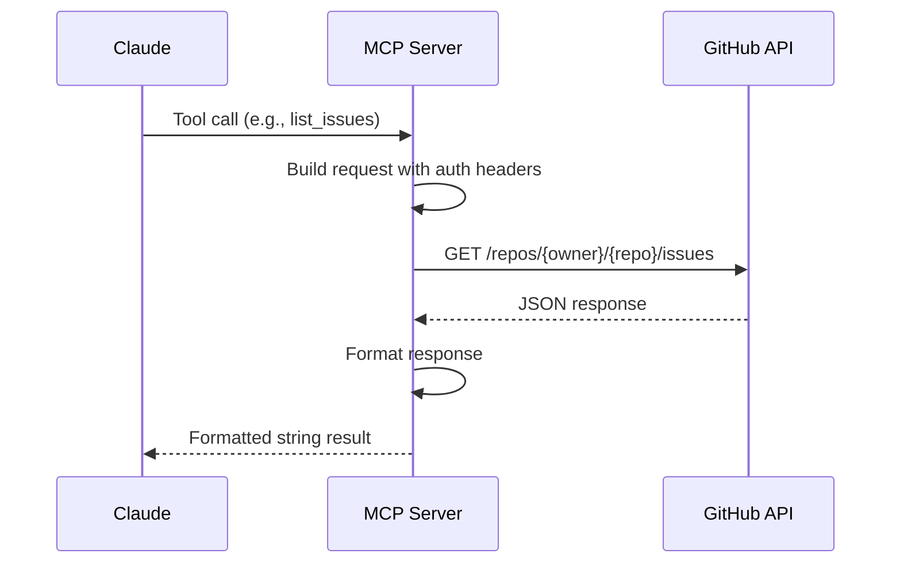

# GitHub MCP Server

An MCP server that wraps the GitHub REST API, letting Claude interact with repositories, issues, PRs, and more.

## Architecture



## How It Works



## Setup

### 1. Get a GitHub Token

1. Go to [GitHub Settings > Developer Settings > Personal Access Tokens](https://github.com/settings/tokens)
2. Generate a new token (classic) with scopes:
   - `repo` - for private repos and creating issues
   - `read:user` - for user info
3. Copy the token

### 2. Configure the Token

Add to your shell profile (`~/.zshrc` or `~/.bashrc`):

```bash
export GITHUB_TOKEN="ghp_your_token_here"
```

Or add to Claude's MCP config with env:

```json
{
  "github-mcp": {
    "command": "uv",
    "args": ["run", "--directory", "/path/to/github-mcp", "server.py"],
    "env": {
      "GITHUB_TOKEN": "ghp_your_token_here"
    }
  }
}
```

### 3. Restart Claude Code

```bash
# Exit and restart to load the new MCP server
```

## Available Tools

| Tool | Description | Auth Required |
|------|-------------|---------------|
| `get_authenticated_user` | Your profile info | Yes |
| `get_user` | Any user's public profile | No |
| `list_user_repos` | User's public repos | No |
| `list_my_repos` | Your repos (inc. private) | Yes |
| `get_repo` | Repo details | No |
| `list_issues` | Repo issues | No |
| `get_issue` | Single issue details | No |
| `create_issue` | Create new issue | Yes |
| `list_pull_requests` | Repo PRs | No |
| `get_pull_request` | PR details | No |
| `search_repos` | Search repositories | No |
| `search_issues` | Search issues/PRs | No |
| `list_workflows` | GitHub Actions workflows | No |
| `list_workflow_runs` | Recent workflow runs | No |

## Example Usage

```
You: "List my repos"
Claude: [calls list_my_repos]

You: "Show open issues in facebook/react"
Claude: [calls list_issues with owner="facebook", repo="react"]

You: "Search for Python CLI frameworks with >1000 stars"
Claude: [calls search_repos with query="cli framework language:python stars:>1000"]

You: "Create an issue in my-org/my-repo about the login bug"
Claude: [calls create_issue with title and body]
```

## Project Structure

```
github-mcp/
├── server.py        # MCP server with all tools
├── pyproject.toml   # Dependencies (mcp, httpx)
├── README.md        # This file
└── .venv/           # Virtual environment
```

## Rate Limits

- **Without token**: 60 requests/hour
- **With token**: 5,000 requests/hour

Always use a token for better experience.
